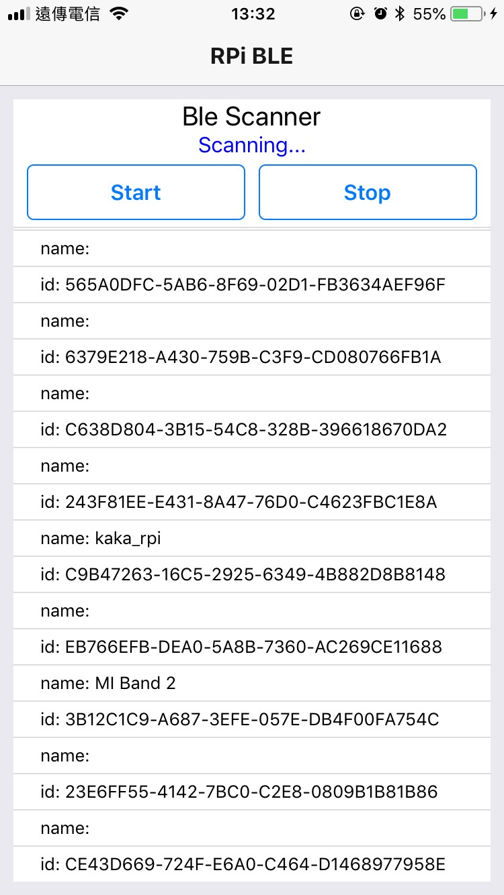
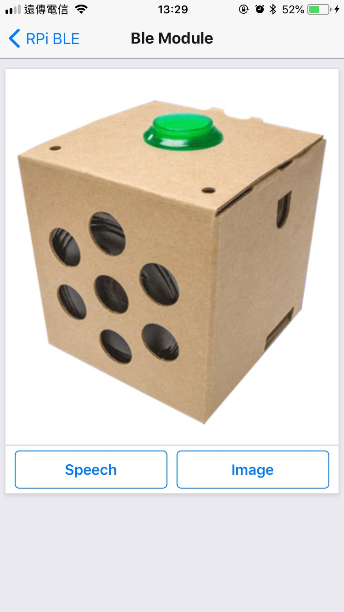

# RPi3 - App and Voice kit

This repo is using app to control ```Voice Kit(RPi3)``` via ``BLE``

## Require
* [Voice kit config](https://github.com/pixnet/2018-pixnet-hackathon/tree/master/demos/ekko)
* [pybleno](https://github.com/Adam-Langley/pybleno)
* [speech_recognition](https://github.com/Uberi/speech_recognition)
* [gTTS](https://github.com/pndurette/gTTS)
* [react-native-ble-plx](https://github.com/Polidea/react-native-ble-plx)

## Usage

1. Install npm module

    ```bash
    cd rpi-app; npm install
    ```

2. Install and Run app
    - use xcode or android studio to install app in your mobile

    - if you've already install app on mobile, you can use:
    ```bash
    npm start
    ```

3. Run ble server(in voice kit)
    ```bash
    cd rpi-ble-server

    python3 main.py
    ```

Then, in app you will see ble list, find your device name and connected!

## Image Example

<div align="center">
      
</div>
